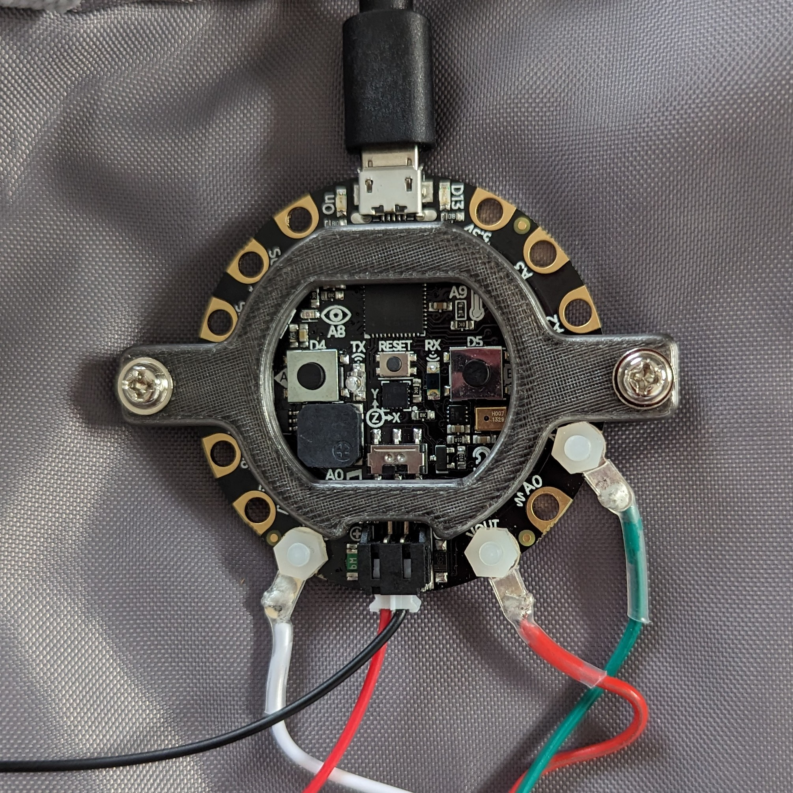

## Materials
Each participant will use the following materials to create their own illuminated backpack (or other decorated item):
- [Circuit Playground Express (CPX) microcontroller](https://www.adafruit.com/product/3333)
- [LED "pebble light" string](https://www.aliexpress.us/item/3256805296568805.html) assembly terminated with ring terminals
- [Woven drawstring cord](https://www.amazon.com/gp/product/B09K6S5FZJ) - long enough to cover the LED string
- 3D printed CPX case
- 3 M3x6mm nylon screws and nuts to attach ring terminals to CPX
- 2 additional M3 screws to secure CPX in printed case
- Battery pack with slide power switch and 3xAA batteries
- JST extension cable
- Needle and thread to sew 3D printed case to backpack. May be used to sew LED string to bag as well.
- Small white zip ties to attach LED string to mesh bag panel (if you prefer not to sew)

## Resources
- More information about the Circuit Playground Express (CPX) controller used in this project can be found [here](https://learn.adafruit.com/adafruit-circuit-playground-express/overview) 
- The latest version of CircuitPython as of 2/3/24 has been installed on your Circuit Playground Express controllers, but you can find the very latest version and additional libraries at [https://circuitpython.org/](https://circuitpython.org/)
- More information about [coding in CircuitPython](https://learn.adafruit.com/welcome-to-circuitpython/overview)

## Assembly
### Step 1

Using the 6mm M3 nylon screws/nuts, attach the ring terminals to the CPX pins, making the following connections:

- **Vout** <==> Red wire
- **GND**  <==> White wire
- **A1**   <==> Green wire

### Step 2

Insert the 3xAA batteries and connect the battery pack using the JST connector, and inserting the extension cable if you'd like to have a longer distance between the batteries and the CPX. Turn on the slide switch and you should see the CPX AND the LED string light up.

### Step 3
    
- Decide where the CPX will attach to your bag, and sew the base piece of the 3D printed case to your bag with a few loops of thread through the holes
- Place the CPX over the base piece
- Place the 3D printed cover over the CPX, and secure in place with two screws as shown

### Step 4
Cut a length of drawstring cord a bit longer than your LED string, and slide it over the LED string. Use the zip ties, or needle and thread, if you prefer, to attach it to the bag in a pattern that you like.

## Programming

### Step 1
Download and install the Mu code editor [here](https://codewith.mu/) onto your laptop

### Step 2

Attach the CPX controller to your computer with a micro:USB cable. It will show up as an external drive on your computer, usually named **CIRCUITPY** You can drag and drop files to this drive.

### Step 3

Open the Mu code editor and use it to edit the file code.py on the **CIRCUITPY** drive. Saving changes in the code here will immediately change the animations on the animations running on the CPX and LED string. Sample programs to run can be found in the [code](./code) directory in this repository, and your instructor will go over them with you. Note that on a CPX, memory restrictions limit the size of a progrm you can run to about 250 lines of code, so you will want to replace code files with new ones rather than copying them all over at once.
 
